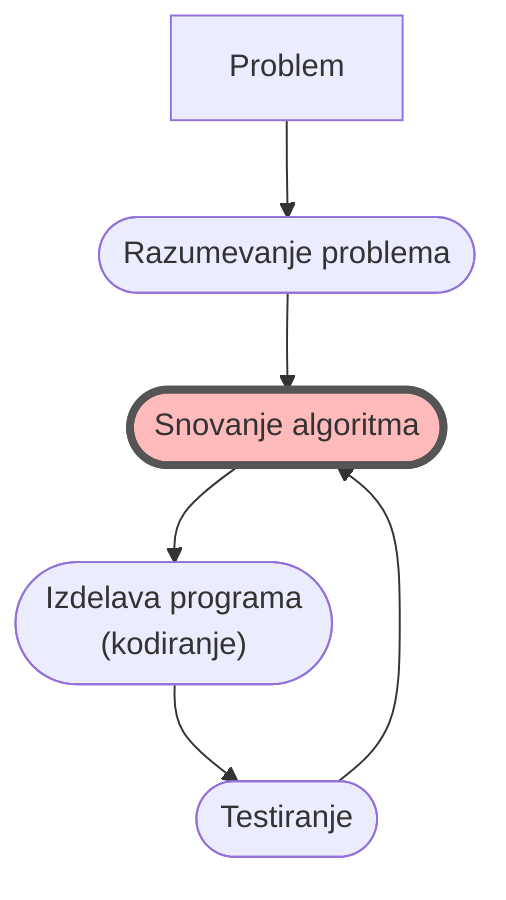

<!-- 
1. Spremeni `vite.config.ts`, da publicDir kaže na ustrezno mapo gradiva za predavanje 
    publicDir: './assets/01'
2. pnpm slidev OP-01-Osnove.md
3. pnpm slidev --remote=geslo OP-01-Osnove.md 
  če si presenter, potem uporabi url, ki ima notri ?password=geslo, da te ne gnjavi za vpis gesla
4. pnpm slidev build --out dist/01 OP-01-Osnove.md
5. pnpm slidev export OP-01-Osnove.md
6. gs -sDEVICE=pdfwrite -dCompatibilityLevel=1.4 -dPDFSETTINGS=/printer -dNOPAUSE -dQUIET -dBATCH -sOutputFile=output.pdf OP-01-Osnove.pdf

Windows: gswin64 ...

7. mv output.pdf OP-01-Osnove.pdf
Windows: move output.pdf OP-01-Osnove.pdf
-->

<ProgressBar bgcolor="#e11d48" completed="1" total="13"/>

# {{ $slidev.configs.title }}

Osnove programiranja

Nejc Ilc

<div class="abs-b m-6 flex gap-1 items-center justify-end text-red-600 opacity-100">
  <div><mdi-map-marker/> R2.41</div>
  <a class="text-2xl icon-btn !border-none !hover:text-gray"
  href="https://fri.uni-lj.si/sl/o-fakulteti/osebje/nejc-ilc">
    <mdi-web-box/>
  </a>
  <a class="text-2xl icon-btn !border-none !hover:text-gray"
  href="mailto:nejc.ilc@fri.uni-lj.si?subject=[OP-FKKT] ">
    <mdi-email/>
  </a>
  <a href="https://github.com/laspp/OP/tree/master/predavanja" target="_blank"
    alt="OP GitHub repository"
    class="text-2xl icon-btn !border-none !hover:text-gray">
    <carbon-logo-github />
  </a>
</div>

<!-- 
1. Predstavitev
- predstavim se sam
- študenti, vsak pove svoje ime in priimek, od kod prihaja, enega od hobijev. 
- Vsak ima 10 sekund.

2. Presenečenje: pripelje se robotek OP (ou-pi) pod škatlo. Ko prvič pritisneš BTN-CENTER, pove »Hello«, ko drugič zapiska Ou-Pi, nato zaspi. Predstavim ga kot našega pomočnika pri učenju programiranja
-->

---

# Gradiva

## Zapiski

- vaši lastni 😁
- prosojnice s predavanj in vaj

## Spletna učilnica

- [https://ucilnica.fri.uni-lj.si](https://ucilnica.fri.uni-lj.si/course/view.php?id=244)
- dogovori in pravila
- forum za **novice** in forum za **vaše objave**
- ...

## Literatura

Miha Moškon:
[*Osnove programiranja v jeziku Python za neračunalničarje*](http://zalozba.fri.uni-lj.si/moskon2020.pdf) (2020)
⭐[živa različica](https://github.com/mmoskon/OP_skripta/raw/master/OP_skripta.pdf)

<!-- 
## Splošno o predmetu
- glej dokument OP-FKKT-splošno-pravila.docx
- pokaži spletno učilnico in razloži forume, pokaži pravila, izvajalce
-->

---
layout: image-right
image: '/img/laptop-stickers.jpg'
caption: 'Fotografija: Jorge Acre '
url: 'https://www.pexels.com/photo/laptop-by-frappe-16625517/'
---

# Kaj mi bo ocena, če pa lahko dobim ...

<div class="flex justify-center" v-click><Image width="300" alt="OP značka" src="/img/OP-znacka-2024.png" caption="Značko dobi vsak, ki reši vsaj 80 % domačih nalog." url="https://ucilnica.fri.uni-lj.si/badges/overview.php?id=16"/></div>

---
layout: fact
transition: slide-left
---

# Zakaj

se ukvarjati z računalništvom?

<div v-click>Digitalna revolucija</div>
<div v-click>Internet stvari</div>
<div v-click>Umetna inteligenca</div>
<div v-click>Industrija 4.0</div>

<!-- 
- Koliko računalnikov srečate od takrat, ko vstanete do takrat, ko pridete na fakulteto v predavalnico? Telefon, pametna ura, mikrovalovka, hladilnik, avto (sodobni avti imajo do 100 vgrajenih računalnikov - mikrokrmilnikov), zapornice na železniškem prehodu, kamere in digitalni prometni znaki na avtocesti, bralnik RFID na uvozu + za vstop v prostore FRI, krmilnik v predavalnici, ki skrbi za luči, gretje, projektor, prenosnik, …
- sodobna družba temelji na tehnološkem napredku na osnovi polprevodnikov (3. industrijska revolucija) – polprevodniki so osnova za izdelavo čipov, ki so srce računalnika
- Česar ne poznaš, se navadno bojiš ali preziraš. Kar poznaš, lahko tudi kritiziraš, spreminjaš in nadzoruješ. 
- Ljudje naše dobe moramo razviti kritično mišljenje v odnosu do umetne inteligence.
-->

---
layout: image
image: '/img/chatGPT-zgodba-1.png'
transition: slide-up
---

---
layout: image
image: '/img/chatGPT-zgodba-2.png'
transition: slide-left
---

---
layout: image
image: '/img/JasonAllen-award-ai.webp'
caption: 'Jason Allen: <i>Théâtre D’opéra Spatial</i>. Prvo mesto med digitalnimi deli na Colorado State Fair. Sliko je izdelala umetna inteligenca (Midjourney)'
transition: slide-left
---

---
layout: image
image: '/img/stable-diffusion-superman-batman-2.jpg'
caption: 'Na <a href="https://stablediffusionweb.com" target="_blank">stablediffusionweb.com</a> smo vnesli opis: <i>clear portrait of a superhero concept between spiderman and batman, background hyper detailed, character concept, full body, dynamic pose, intricate, highly detailed, digital painting, artstation, concept art, smooth, sharp focus, illustration</i>.'
transition: slide-left
---

---
layout: iframe
url: https://www.youtube.com/embed/HK6y8DAPN_0?si=MGypuAqmRvgQ036p
transition: slide-left
---

---
layout: image
image: '/img/WSE2-vs-A100.png'
transition: slide-left
---

---
layout: fact
---

# Zakaj
se učiti programiranja?

<!-- 
- Mentimeter: asociacija na "programiranje"
- Mentimeter: Kdo zna napisati program?
  - pričakujem, da vsi odgovorijo pozitivno
  - ker ne: grem stavit, da znate napisati postopek za umivanje zob
- Kviz: 5 vprašanj o računalništvu
-->

---

<!--# Tri vrline <Marker class="text-red-500">ANTI</Marker> dobrega programerja-->
# Tri vrline dobrega programerja [^1]
... ali morda "anti-vrline"?

<div class="grid grid-cols-3 gap-x-4">
<div>
<div v-click>

> ## Lenoba
> Zaradi te lastnosti se zelo trudite, da bi zmanjšali skupno porabo energije. Zaradi nje pišete programe za varčevanje z delom, ki bodo koristni tudi za druge ljudi, in dokumentirate, kaj ste napisali, da vam ne bo treba odgovarjati na številna vprašanja o tem.

</div>
</div>

<div>
<div v-click>

> ## Nestrpnost
> Jeza, ki jo čutite, ko je računalnik len. Zaradi nje pišete programe, ki se ne odzivajo le na vaše potrebe, temveč jih dejansko predvidevajo. Ali pa se vsaj pretvarjajo, da jih predvidevajo.

</div>
</div>

<div>
<div v-click>

> ## Napuh
> Zaradi te lastnosti pišete (in vzdržujete) programe, o katerih drugi ljudje ne bodo želeli reči nič slabega.

</div>
</div>
</div>

[^1]: Povzeto po [Larryju Wallu](https://thethreevirtues.com/), avtorju programskega jezika Perl. Prevedeno iz angleščine z globoko nevronsko mrežo [DeepL](https://www.deepl.com/translator#en/sl/Laziness%3A%20The%20quality%20that%20makes%20you%20go%20to%20great%20effort%20to%20reduce%20overall%20energy%20expenditure.%20It%20makes%20you%20write%20labor-saving%20programs%20that%20other%20people%20will%20find%20useful%20and%20document%20what%20you%20wrote%20so%20you%20don't%20have%20to%20answer%20so%20many%20questions%20about%20it.%0A%0AImpatience%3A%20The%20anger%20you%20feel%20when%20the%20computer%20is%20being%20lazy.%20This%20makes%20you%20write%20programs%20that%20don't%20just%20react%20to%20your%20needs%2C%20but%20actually%20anticipate%20them.%20Or%20at%20least%20pretend%20to.%0A%0AHubris%3A%20The%20quality%20that%20makes%20you%20write%20(and%20maintain)%20programs%20that%20other%20people%20won't%20want%20to%20say%20bad%20things%20about.)

<!--
Zgodba o Spletnem stražarju
- družinski tabor blizu Banovcev
- navdušeni, radi bi se prijavili tudi letos
- obstaja spletna prijavnica, mesta so takoj zasedena
- osveževanje spletne strani je mučno in zahteva čas
- naredil sem program, ki preverja spletno stran za točno določen dogodek poljubno pogosto in pošlje email in SMS, ko zazna kaj takega
- preobrat: na FB so objavili datum odprtja prijavnice
- strežnik se je razsul 
- ure programiranja so bile zaman (res?)

-->
---
layout: image-right
image: './img/curtain-theatre.jpg'
caption: 'Fotografija: Gwen King'
url: 'https://unsplash.com/photos/m3th3rIQ9-w'
---

# Na koncu bi rad, da

<div v-click>

- se ne bojite računalnika. Ni magičen predmet.

</div>
<div v-click>

- postane računalnik vaše novo "super orodje".

</div>
<div v-click>

- vam znanje programiranja dá moč kritičnega mišljenja. Da zmorete pogledati v zaodrje.

</div>
<div v-click>

- boste rekli, da je bilo vsaj malo zabavno.

</div>

<br/>
<br/>

<div v-click>

> Česar ne poznaš, se navadno bojiš ali preziraš.\
> Kar poznaš, lahko tudi kritiziraš, spreminjaš in nadzoruješ.\
> Razviti moramo kritično mišljenje v odnosu do tehnologije.

</div>

---
layout: image-left
image: '/img/cooking.jpg'
caption: 'Fotografija: Mae Mu'
url: 'https://unsplash.com/photos/rgRbqFweGF0'
---

# Kaj je programiranje?

<div v-click>

### Program je ...
> "Skupek dejanj v določenem zaporedju, ki jih naprava opravi sama." (SSKJ)

Zaporedju dejanj lahko rečemo tudi navodilo, postopek, ali <Mark>algoritem</Mark>.
</div>

<div v-click>

### Programiranje je torej ...

> Izdelava algoritma, ki se izvede na računalniku.

Dragocena veščina: <Mark>algoritmično razmišljanje</Mark>. Razbijanje problema na podprobleme.
</div>

<div v-click>

### Računalnik pa je ...

> "Elektronska naprava za reševanje nalog na osnovi vloženega programa." (SSKJ)

</div>

---
transition: fade
---

# Življenje programerja

<div class="grid grid-cols-2 gap-x-4">

<div>


</div>
<div>

<div v-click>

 ... je lepše z OP 😀
<br/>

<Image width="380" alt="LEGO Mindstorms EV3" src="/img/EV3.jpg" caption="Slika: LEGO Mindstorms EV3" url="https://makecode.mindstorms.com/getting-started/use"/>

</div>
</div>
</div>

---
transition: fade
---

# Življenje programerja: imamo problem

<div class="grid grid-cols-2 gap-x-4">

<div>


</div>
<div>

Problem/cilj/naloga/izziv:

OP naj se 2 sekundi premika naprej. 🫡


</div>
</div>

---
transition: fade
---

# Življenje programerja: analizirajmo problem

<div class="grid grid-cols-2 gap-x-4">

<div>


</div>
<div>

Najprej moramo spoznati anatomijo robotka OP: njegove sestavne dele, način premikanja, ...

<div style="margin:50px 0px;"> <iframe width="100%" title="Ev3-rem-driving-base" frameborder="0" allowfullscreen mozallowfullscreen="true" webkitallowfullscreen="true" allow="autoplay; fullscreen; xr-spatial-tracking" xr-spatial-tracking execution-while-out-of-viewport execution-while-not-rendered web-share src="https://sketchfab.com/models/7295e6567a29477bbd94908311987dbc/embed"> </iframe> <p style="font-size: 13px; font-weight: normal; margin: 0px; color: #4A4A4A;"> <a href="https://sketchfab.com/3d-models/ev3-rem-driving-base-7295e6567a29477bbd94908311987dbc?utm_medium=embed&utm_campaign=share-popup&utm_content=7295e6567a29477bbd94908311987dbc" target="_blank" rel="nofollow"> Ev3-rem-driving-base </a> by <a href="https://sketchfab.com/bgcaastemkids?utm_medium=embed&utm_campaign=share-popup&utm_content=7295e6567a29477bbd94908311987dbc" target="_blank" rel="nofollow"> bgcaastemkids </a> on <a href="https://sketchfab.com?utm_medium=embed&utm_campaign=share-popup&utm_content=7295e6567a29477bbd94908311987dbc" target="_blank" rel="nofollow">Sketchfab</a></p></div>

Torej, ima programirljive možgane ("kocko"), dva motorja, dve kolesi, ...

</div>
</div>

---
transition: fade
---

# Življenje programerja: analizirajmo problem

<div class="grid grid-cols-2 gap-x-4">

<div>


</div>
<div>

Razmišljamo naprej:

<div v-click>

- Da se robotek OP lahko premakne naprej, mora zavrteti kolesi.

</div>
<div v-click>

- Kolesi mora zavrteti v pravo smer (sicer bo šel OP nazaj ali pa se bo vrtel).

</div>

<div v-click>

- Kolo je pritrjeno na motor - če zavrtimo motor, se bo zavrtelo tudi kolo.

</div>

<div v-click>

- Zagnati moramo oba motorja za dve sekundi.

</div>

<div v-click>

- Motorja sta preko kabla priklopljena na "kocko", ki vsebuje računalnik, in sicer na izhoda B in C.

</div>

<div v-click>

- Sprogramirati moramo računalnik v "kocki", da bo upravljala z motorjema.

</div>

</div>
</div>

---
transition: fade
---

# Življenje programerja: načrtujmo algoritem

<div class="grid grid-cols-2 gap-x-4">

<div>



</div>
<div>

Napišimo recept po slovensko:

<div v-click>

1. Nastavi moč motorja B na 100 %.

</div>

<div v-click>

2. Nastavi moč motorja C na 100 %.

</div>

<div v-click>

3. Zaženi motor B.

</div>

<div v-click>

4. Zaženi motor C.

</div>

<div v-click>

5. Počakaj 2 sekundi.

</div>

<div v-click>

6. Ustavi motor B.

</div>

<div v-click>

7. Ustavi motor C.

</div>

<div v-click>

8. Končaj program.

</div>

</div>
</div>

---
transition: fade
---

# Življenje programerja: izdelajmo program

<div class="grid grid-cols-2 gap-x-4">

<div>


</div>
<div>

<div v-click>

Kako računalniku povedati, kaj naj naredi?

</div>

<div v-click>

&rarr; Tako, da "govorimo" <Mark>programski jezik</Mark>. Po možnosti takega, ki je človeku prijazen.

Pravimo tudi, da napišemo <Mark>izvorno kodo</Mark> programa.

</div>

<div v-click>

<Image alt="Najbolj popularni programski jeziki" src="/img/top-programming-languages.jpg" caption="Najbolj popularni programski jeziki. Avtor: Mike Shannon." url="https://gowithcode.com/top-programming-languages"/>

</div>

</div>
</div>

---
transition: fade
---

# Življenje programerja: ali deluje?

<div class="grid grid-cols-2 gap-x-4">

<div>


</div>
<div>

<div v-click>


</div>

<div v-click>

<div class="text-8xl abs-tr m-10">
🤦
</div>

<arrow x1="600" y1="420" x2="430" y2="355" color="#333" width="4" arrowSize="1" />

</div>

<div v-click>
Vaše programe boste/bomo testirali z uporabo drugih programov (enotski testi).
</div>

</div>
</div>

---
transition: fade
---

# Življenje programerja: se vrti v krogu

<div class="grid grid-cols-2 gap-x-4">

<div>


</div>
<div>

Ali je morda to bolj spirala?

<Image width="350" alt="Spiralne stopnice" src="/img/nicolas-hoizey-spiral-unsplash.jpg" caption="Fotografija: Nicolas Hoizey" url="https://unsplash.com/photos/VU8HxMAP79U"/>

</div>
</div>

---

# Program za robotka OP

Uporabimo programski jezik [Scratch](https://scratch.mit.edu/) v razvojnem okolju [EV3 Classroom](https://education.lego.com/en-us/downloads/mindstorms-ev3/software)

<div v-click>

<div class="grid grid-cols-2 gap-x-4">

<div>


</div><div>

To je bil naš recept:

1. Nastavi moč motorja B na 100 %.
2. Nastavi moč motorja C na 100 %.
3. Zaženi motor B.
4. Zaženi motor C.
5. Počakaj 2 sekundi.
6. Ustavi motor B.
7. Ustavi motor C.
8. Končaj program.

</div>
</div>
</div>

---
layout: image-right
image: '/img/Jusepe_de_Ribera-Euclid.jpg'
caption: 'Jusepe de Ribera: Euclid'
url: 'https://commons.wikimedia.org/wiki/File:Jusepe_de_Ribera_-_Euclid_-_2001.26_-_J._Paul_Getty_Museum.jpg'
---

# Star problem
Iskanje največjega skupnega delitelja

Pojem *največji skupni delitelj* označimo z `GCD` (ang. Greatest Common Divisor)

Denimo, da imamo števili $100$ in $75$.

Antična ugotovitev: njun največji skupni delitelj je hkrati tudi največji skupni delitelj števil $75$ in $25$.

```
GCD(100, 75) = GCD(75, 25)
```

Velja tudi naprej:

```
GCD(75, 25) = GCD(50, 25) = GCD(25, 25) = 25
```

Imamo rezultat: $25$!

---

# Evklidov algoritem
Eden najstarejših algoritmov v splošni rabi, opisan v knjigi *Elementi* iz 300 pr. Kr.

<div class="grid grid-cols-2 gap-x-4">

<div>

## Vhod

Dve celi števili

## Izhod

Največji skupni delitelj vhodnih števil

## Postopek

Dokler sta obe števili različni, odštevaj manjše število od večjega.

</div>

<div>

<Image width="500" alt="Papirus - Evklid - Elementi." src="/img/Euclid-Elements.jpg" caption="Papirus z delčkom Evklidovih Elementov." url="https://commons.wikimedia.org/wiki/File:P._Oxy._I_29.jpg"/>

</div>

</div>

---

# Evklidov algoritem: narišimo

```mermaid {theme: 'neutral', scale: 0.9}
%%{ init: { 'flowchart': { 'curve': 'basis' } } }%%
graph LR
A([Določi A])
B([Določi B])
C{A različen<br/> od B?}
D{A večji od B?}
E(["A &larr; A – B"])
F(["B &larr; B – A"])
G([Izpiši A])
H(("&nbsp;"))
A --> B
B --> C
C -->|"&nbsp; DA &nbsp;"| D
C ---->|"&nbsp; NE &nbsp;"| G
D -->|"&nbsp; DA &nbsp;"| E
D -->|"&nbsp; NE &nbsp;"| F
E --> H
F --> H
H --> C
linkStyle 2,4 color:green;
linkStyle 3,5 color:red;
```

Narišimo algoritem v obliki <Mark>diagrama poteka</Mark> kot zaporedje akcij (kapsula) in odločitev (romb)



---

# Evklidov algoritem: kodirajmo
Programski jezik Scratch, <a href="https://scratch.mit.edu/projects/799365193" target="_blank">ogled projekta v brskalniku</a>

<div class="grid grid-cols-2 gap-x-4">

<div>

<iframe src="https://scratch.mit.edu/projects/799365193/embed" allowtransparency="true" width="400" height="402" frameborder="0" scrolling="no" allowfullscreen></iframe>

</div>

<div>

<div v-click>
<a href="https://scratch.mit.edu/projects/799365193" target="_blang">

</a>
</div>

</div>

</div>

---

# Evklidov algoritem: kodirajmo zares

<div class="grid grid-cols-2 gap-x-4">

<div>

## Psevdo koda

Neformalni zapis algoritma po korakih

<div v-click>

```
določi A
določi B
dokler je A različen od B ponavljaj:
    če je A večji od B:
        A naj dobi vrednost A – B
    sicer (če je B večji od A):
        B naj dobi vrednost B – A
izpiši A
```

</div>

</div>

<div>

<div v-click>

## Programski jezik Python

Psevdo kodo prepišimo v angleščino

```python
A = 100
B = 75
while A != B:
    if A > B:
        A = A - B
    else:
        B = B - A
print(A)
```

</div>

</div>

</div>

---
layout: image
image: /img/sebastian-staines-skiing-unsplash.jpg
caption: 'Fotografija: Sebastian Staines'
url: 'https://unsplash.com/photos/xZIFEPtRsRI'
---

# "Oči, jaz znam smučat!"

pravi moj štiriletni sin, ko gleda prenos slaloma po TV ...

<style>
h1, p {
  color: black;
}
</style>
