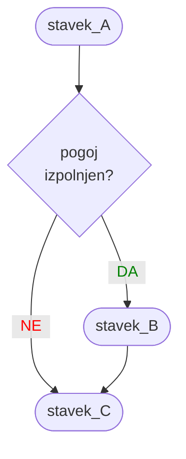
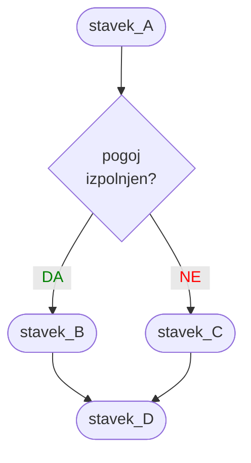
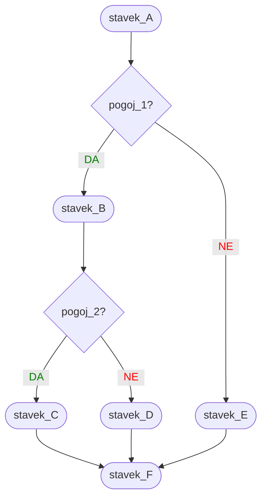
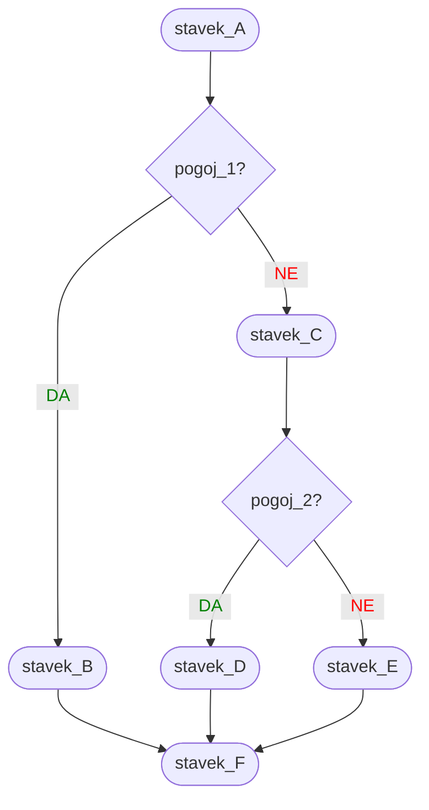
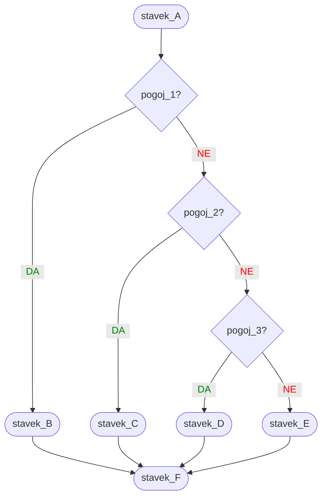

<!-- 
./present.sh 3
./export_pdf.sh 3
-->

<ProgressBar bgcolor="#e54240" :completed=3 :total=13 />

# {{ $slidev.configs.title }}

Osnove programiranja

Nejc Ilc

<div class="abs-b m-6 flex gap-1 items-center justify-end text-red-500">
  <div><mdi-map-marker/> R2.41</div>
  <a class="text-2xl icon-btn !border-none !hover:text-gray"
  href="https://fri.uni-lj.si/sl/o-fakulteti/osebje/nejc-ilc">
    <mdi-web-box/>
  </a>
  <a class="text-2xl icon-btn !border-none !hover:text-gray"
  href="mailto:nejc.ilc@fri.uni-lj.si?subject=[OP-FKKT] ">
    <mdi-email/>
  </a>
  <a href="https://github.com/laspp/OP/tree/master/predavanja" target="_blank"
    alt="OP GitHub repository"
    class="text-2xl icon-btn !border-none !hover:text-gray">
    <carbon-logo-github />
  </a>
</div>

<!--
Zapiski predavatelja
-->

---

# Kaj naj danes oblečem?
Vsem znana jutranja dilema, tudi za Praskeža

Začnimo preprosto:

- recimo, da poznamo samo zunanjo temperaturo in
- Praskež ima v omari samo zimsko opremo (toplo kapo s cofom in zimske škornje).

Praskež se mora odločiti. Noče, da ga zebe. Še manj pa, da mu je vroče. Pomagajmo mu!

Ali si bo Praskež nadel kapo in obul škornje je sedaj odvisno od določenega pogoja - temperature.

Recimo, da je primeren prag pri 5 °C. Če je zunaj manj stopinj, naj uporabi kapo in škornje, sicer ne.


---

# Kaj naj danes oblečem? <Marker>obleke-v1</Marker>

Narišimo v Scratchu in napišimo v Pythonu

<div class="grid grid-cols-2 gap-x-4">

<div class="border-r-2 px-4">

<a href="https://scratch.mit.edu/projects/806946181" target="_blank">
<Image alt="Scratch program" src="/img/Scratch-obleke-v1.png" caption="Klikni sliko za ogled v brskalniku"/>
</a>

</div>

<div>

Python nima preoblek tako kot Praskež, oranžno bistvo pa je enako. Spoznajmo <mark>*če*</mark> (`if`).

```python
videz = 'navaden'
odgovor = input('Koliko stopinj je zunaj? ')
odgovor = float(odgovor)
if odgovor < 5:
    print('Zima! Rabim kapo in tople škornje.')
    videz = 'kapa in škornji'
print('Zdaj grem lahko ven! Moj videz:', videz)
```

Preizkus:

```
Koliko stopinj je zunaj? 3
Zima! Rabim kapo in tople škornje.
Zdaj grem lahko ven! Moj videz: kapa in škornji
```

</div>
</div>

---

# Kaj naj danes oblečem? <Marker>obleke-v2</Marker>

Praskež potrebuje obutev, tudi če ni mraza. V omaro mu dodamo superge.

<div class="grid grid-cols-2 gap-x-4">

<div class="border-r-2 px-4">

<a href="https://scratch.mit.edu/projects/806945172" target="_blank">
<Image width="350" alt="Scratch program" src="/img/Scratch-obleke-v2.png" caption="Klikni sliko za ogled v brskalniku"/>
</a>

</div>

<div>

Spoznajmo <mark>blok *sicer*</mark> (`else`) pogojnega stavka.

```python
videz = 'navaden'
odgovor = input('Koliko stopinj je zunaj? ')
odgovor = float(odgovor)
if odgovor < 5:
    print('Zima! Rabim kapo in tople škornje.')
    videz = 'kapa in škornji'
else:
    print('Ni mraza, obul bom superge.')
    videz = 'superge'
print('Zdaj grem lahko ven! Moj videz:', videz)
```

Preizkus:

```
Koliko stopinj je zunaj? 10
Ni mraza, obul bom superge.
Zdaj grem lahko ven! Moj videz: superge
```

</div>
</div>

---

# Kaj naj danes oblečem? <Marker>obleke-v3.0</Marker>

Kaj pa, ko je vroče? Veliko tekočine in pokrivalo na glavo!

<div class="grid grid-cols-2 gap-x-4">

<div class="border-r-2 px-4">

<a href="https://scratch.mit.edu/projects/806879537" target="_blank">
<Image width="280" alt="Scratch program" src="/img/Scratch-obleke-v3.png" caption=""/>
</a>

</div>

<div>

Spoznajmo <mark>ugnezdeni</mark> pogojni stavek.

```python
videz = 'navaden'
odgovor = input('Koliko stopinj je zunaj? ')
odgovor = float(odgovor)
if odgovor < 5:
    print('Zima! Rabim kapo in tople škornje.')
    videz = 'kapa in škornji'
else:
    if odgovor > 25:
        print('Vroče! Vzamem pokrivalo in pijačo.')
        videz = 'pijača in pokrivalo'
    else:
        print('Prijetno toplo, obujem superge.')
        videz = 'superge'
print('Zdaj grem lahko ven! Moj videz:', videz)
```

</div>
</div>

---

# Kaj naj danes oblečem? <Marker>obleke-v3.1</Marker>

Scratch tega ne pozna ...

<div class="grid grid-cols-2 gap-x-4">

<div class="border-r-2 px-4">

Ugnezdeni pogojni stavek s prejšnje strani:

```python
videz = 'navaden'
odgovor = input('Koliko stopinj je zunaj? ')
odgovor = float(odgovor)
if odgovor < 5:
    print('Zima! Rabim kapo in tople škornje.')
    videz = 'kapa in škornji'
else:
    if odgovor > 25:
        print('Vroče! Vzamem pokrivalo in pijačo.')
        videz = 'pijača in pokrivalo'
    else:
        print('Prijetno toplo, obujem superge.')
        videz = 'superge'
print('Zdaj grem lahko ven! Moj videz:', videz)
```

</div>

<div>

Spoznajmo <mark>sicer-če</mark> (`elif`) in zapišimo drugače.

```python
videz = 'navaden'
odgovor = input('Koliko stopinj je zunaj? ')
odgovor = float(odgovor)
if odgovor < 5:
    print('Zima! Rabim kapo in tople škornje.')
    videz = 'kapa in škornji'
elif odgovor > 25:
    print('Vroče! Vzamem pokrivalo in pijačo.')
    videz = 'pijača in pokrivalo'
else:
    print('Prijetno toplo, obujem superge.')
    videz = 'superge'
print('Zdaj grem lahko ven! Moj videz:', videz)
```

✨ Odlično, program je zdaj malo bolj pregleden!

</div>
</div>

---

# `if`

Uporabimo, ko želimo izvesti blok stavkov pod določenim pogojem

<div class="grid grid-cols-3 gap-x-4">

<div class="col-span-2 code-lg">

```python
stavek_A

if pogoj:
    # Ta stavek izvedemo, ko je `pogoj` resničen
    stavek_B
    # Lahko dodamo stavke ...

# Zaključimo blok pogojnega stavka
# Naslednji stavek se izvede ne glede na `pogoj`
stavek_C
```

</div>
<div class="text-center">



</div>
</div>

---

# Zamikanje

Kako povemo, kateri stavki se izvedejo ob izpolnjenem pogoju?

<div class="grid grid-cols-3 gap-x-4">

<div class="col-span-2 code-lg">

```python
stavek_A

if pogoj:
    # Ta stavek izvedemo, ko je `pogoj` resničen
    stavek_B
    # Lahko dodamo stavke ...

# Zaključimo blok pogojnega stavka
# Naslednji stavek se izvede ne glede na `pogoj`
stavek_C
```

V Pythonu bloke stavkov že na daleč opazimo, saj se od drugih delov kode ločijo po <mark>zamiku</mark>!

</div>
<div>

- Po bontonu en zamik naredimo tako:
  4 × <kbd>preslednica</kbd>.

- Thonny in ostala razvojna okolja pritisk tipke <kbd>Tab ↹</kbd> spremenijo v presledke.

- Skrivnost: poskusite kombinacijo <kbd>Shift</kbd> + <kbd>Tab&nbsp;↹</kbd>

</div>
</div>

---

# `if-else`

Uporabimo, ko želimo izvesti blok stavkov pod določenim pogojem. Poleg tega želimo, da se drugi blok stavkov izvede samo takrat, ko ta pogoj ni resničen.

<div class="grid grid-cols-3 gap-x-4">

<div class="col-span-2 code-lg">

```python
stavek_A

if pogoj:
    # Ta stavek izvedemo, ko je `pogoj` resničen
    stavek_B
    # Lahko dodamo stavke ...
else:
    # Ta stavek izvedemo, ko `pogoj` ni resničen
    stavek_C
    # Lahko dodamo stavke ...

# Zaključimo blok pogojnega stavka
# Naslednji stavek se izvede ne glede na `pogoj`
stavek_D
```

</div>
<div class="text-center">



</div>
</div>

---

<div class="grid grid-cols-3 gap-x-4">

<div class="col-span-2 code-lg">

# Ugnezdeni pogojni stavek

Naredimo hierarhijo blokov pogojnih stavkov. <mark>Pazimo na dodatne zamike</mark>.

```python
stavek_A
if pogoj_1:
    # Če je `pogoj_1` resničen
    stavek_B
    if pogoj_2:
        # Če sta resnična `pogoj_1` in `pogoj_2`
        stavek_C
    else:
        # Če je `pogoj_1` resničen in `pogoj_2` ni
        stavek_D
else:
    # Če `pogoj_1` ni resničen
    stavek_E

# Naslednji stavek se izvede ne glede na pogojni stavek
stavek_F
```

</div>
<div class="text-center">



</div>
</div>

---

<div class="grid grid-cols-3 gap-x-4">

<div class="col-span-2 code-lg">

# Ugnezdimo drugam

Kaj se zgodi, če pogojni stavek ugnezdimo v blok `else`?

```python
stavek_A
if pogoj_1:
    # Če je `pogoj_1` resničen
    stavek_B
else:
    # Če `pogoj_1` ni resničen
    stavek_C
    if pogoj_2:
        # Če `pogoj_1` ni resničen, `pogoj_2` pa je
        stavek_D
    else:
        # Če sta `pogoj_1` in `pogoj_2` neresnična
        stavek_E

# Naslednji stavek se izvede ne glede na pogojni stavek
stavek_F
```

</div>
<div class="text-center">



</div>
</div>

---

<div class="grid grid-cols-3 gap-x-4">

<div class="col-span-2">

# `if-elif-...-elif-else`

Imamo več pogojev -- ko je prvi od njih resničen, izvedemo njegov blok.

<div class="code-lg">

```python
stavek_A
if pogoj_1:
    # Če je `pogoj_1` resničen
    stavek_B
elif pogoj_2:
    # Če `pogoj_1` ni resničen, `pogoj_2` pa je
    stavek_C
elif pogoj_3:
    # `pogoj_3` resničen, ostala dva ne
    stavek_D
else:
    # Če noben pogoj ni resničen
    stavek_E

# Naslednji stavek se izvede ne glede na pogojni stavek
stavek_F
```

</div>

</div>
<div class="text-center">



</div>
</div>

---

# Primerjalni operatorji
Uporabimo jih za sestavljanje pogoja.

| **operator** | **opis** | **primeri**|     |
| :----------: | :------- | ---------- | --- |
| `==`  | enak    | `+0 == -0` → `True`  | `'Ana' == 'ana'` → `False` |
| `!=`  | ni enak | `1 != 1` → `False`   | `'Ana' != 'ana'` → `True`  |
| `>`   | večji   | `1 > 1` → `False`    | `'Anna' > 'Ana'` → `True` |
| `>=`  | večji ali enak | `1 >= 1` → `True`  | `'ABC' >= 'ABD'` → `False` |
| `<`   | manjši | `0.33 < 1/3` → `True`  | `'A' < 'a'` → `True` |
| `<=`  | manjši ali enak | `0.0 <= -0.0` → `True`  | `'1a' <= '2a'` → `True` |

<br/>

Vsi primeri v tabeli so <mark>logični izrazi</mark>. Rezultat logičnega izraza je tipa `bool`.

---

# Logični operatorji
`1 + 2**3` je matematični oz. aritmetični izraz. Logični izraz je sestavljen iz pogojev in logičnih operatorjev.

<div class="grid grid-cols-2 gap-x-4">
<div>
<div v-click>

## `not`

Pomeni "ne", zanikanje. Ima prednost pred `and` in `or`.

<div class="grid grid-cols-2 gap-x-2">
<div class="border-2 text-center">

`not True` → `False`

</div>
<div class="border-2 text-center">

`not False` → `True`

</div>
</div>
</div>

<div v-click>

## `and`

Pomeni "in", hkratnost. Ima prednost pred `or`.

<div class="grid grid-cols-3 gap-2">
<div class="border-2 text-center">

`True and True` → `True`

</div>
<div class="border-2 text-center">

`True and False` → `False`

</div>

<div class="border-2 text-center">

`False and False` → `False`

</div>
</div>
</div>

</div>
<div>

<div v-click>

## `or`

Pomeni "ali", izbirnost.

<div class="grid grid-cols-3 gap-2">
<div class="border-2 text-center">

`True or True` → `True`

</div>
<div class="border-2 text-center">

`True or False` → `True`

</div>

<div class="border-2 text-center">

`False or False` → `False`

</div>
</div>
</div>
<br/>
<br/>

<div v-click>

Logični izraz lahko vsebuje kombinacijo logičnih operatorjev, denimo:

`True or False and not False` → `True`

</div>
</div>
</div>

---
layout: two-cols
---

# Nizanje operatorjev
<br/>

Kako preverimo, ali je vrednost `x` med 10 in 20?

Ena možnost je ta:

`x > 10 and x < 20`

Nam bolj naraven pa je zapis, ki uporablja nizanje operatorjev:

`10 < x < 20`

::right::

# Operatorja vsebovanosti
<br/>

Python pozna tudi operatorja `in` in `not in`, ki povesta, ali je neka stvar vsebovana v drugi. Poglejmo si to na primeru nizov.

`'bar' in 'rabarbara'` → `True`

`'b' not in 'RaBarBara'` → `True`

Na ta način lahko preverimo, ali niz vsebuje določen drug niz oziroma določeno črko.
Uporabna sta tudi pri rečeh, ki jih za zdaj še ne poznamo (seznami, terke, množice, slovarji).

---

# Kateri operator je torej bolj pomemben?

| **operator** | **opis** | **prioriteta** |
| ------------ | -------- | :--------------: |
| `**` | potenciranje | največja |
| `*`, `/`, `//`, `%` | množenje in deljenje |  |
| `+`, `-` | seštevanje in odštevanje | |
|  `==`, `!=`, `>`, `>=`, `<`, `<=` | primerjalni operatorji | |
| `is`, `is not` | operatorja identitete (bomo razložili pozneje) | |
| `in`, `not in` | operatorja vsebovanosti | |
| `not` | logični ne | |
| `and` | logični in | |
| `or` | logični ali | najmanjša |

<arrow x1="860" y1="200" x2="860" y2="470" color="#e54240" width="2" />

---

<div class="grid grid-cols-2 gap-x-4">
<div class="border-r-2 px-4">

# `False`

Vse, kar je prazno ali nično, Python razume kot `False`.

Neko številčno vrednost ali niz (ali druge eksotične živali, ki jih bomo spoznali ta semester) lahko pretvorimo v logično vrednost z uporabo funkcije `bool()`.

Naslednje vrednosti se torej razumejo kot `False`:

- ničla: `0` in `0.0`
- prazen niz: `''`
- nič: `None` (to je posebna rezervirana beseda, ki pomeni "nič")
- prazen seznam `[]`, terka `()`, množica `set()`, slovar `{}`, obseg `range(0)`

</div>
<div>

# `True`

Vse, kar ni `False` 😊

</div>
</div>

---

# Utrdimo vse skupaj

```python
>>> 1 <= 1.0 < 1.5
True
>>> 1 <= 1.0 < 1.5 == 1 + 0.5
True
>>> not 1 == 0 and 'a' != 'A'
True
>>> 0 == 0.0 and 1 == 1.1
False
>>> 1 + 1 > 1 and 'Anton' < 'Toni' and 2**5 >= 32
True
>>> 'pes' != 'mačka' or 'pes' == 'kuža'
True
>>> bool(0) or not bool(1)
False
>>> bool(1) and bool(2) and bool(3)
True
>>> bool(0) or bool(1) and bool(2)
True
>>> not bool('') or bool(1) and bool('a')
True
>>> not (bool('') or bool(1) and bool('a'))
False
>>> 'pes' in 'pesjan' and not 'love' not in 'Slovenija'
True
```

---

# Kratek stik za radovedne
Privarčujmo nekaj časa in energije s tem trikom

Recimo, da bi radi izračunali izraz `x**y > x*y`, vendar samo, če sta tako `x` kot tudi `y` manjša od 1000. Lahko zapišemo tako (mimogrede bomo še videli, da lahko posamezne stavke med seboj ločimo s podpičjem):

```python
>>> x = 3; y = 4; x < 1000 and y < 1000 and x**y > x*y
True
```

V zgornjem logičnem izrazu imamo tri trditve, med katerimi je operator `and`. Celoten logični izraz bo v tem primeru resničen (`True`) samo takrat, ko bodo resnične vse tri trditve. Prva trditev `x < 1000` je resnična, zato moramo preveriti tudi drugo trditev. Ta je prav tako resnična, saj ima `y` vrednost 4 kar je manj kot 1000. Sledi še zadnji del izraza, ki ga moramo izračunati, če želimo vedeti, ali je celoten izraz resničen ali ne. Zdaj izračunamo `x**y` in `x*y` ter ju primerjamo. Rezultat je `True`.

Kaj pa, če nastavimo tako: `x = 3` in `y = 4000`?
Prva trditev, da je 3 < 1000, je resnična. Gremo naprej. Pri drugi se zatakne, ker 4000 ni manjše od 1000. Dobimo `False`, ki pri uporabi operatorja `and` naredi kratek stik in varovalko "zabriše ven" -- končamo z računanjem celotnega izraza, ker točno vemo, da bo rezultat vedno `False`. S tem se izognemo potratnemu računanju `3**4000`. Podobno velja za operator `or`, vendar ravno obratno: logični izraz računamo po kosih vse dokler ne naletimo na `True` -- tam se ustavimo.

---
layout: image-right
image: '/img/maick-maciel-7Qe9xOLMw3Q-unsplash.jpg'
caption: 'Fotografija: Maick Maciel'
url: 'https://unsplash.com/photos/7Qe9xOLMw3Q'
---
  
# Pobegni! <Marker>igra-pobegni-v1.0</Marker>
Naredimo svojo igro, pravo pustolovščino!

<div class="code-lg">

```
Znajdeš se v neznani sobi. 
Boli te glava, pogled je meglen. 
Ne veš, zakaj si tu. 
Veš pa, da je pobeg edina rešitev.

Soba nima oken, ima pa modra vrata.
Sredi sobe je miza in nekaj na njej.

Izberi eno od možnosti:
1: Odpri modra vrata.
2: Poglej, kaj je na mizi.
Izbira: 
```

</div>
