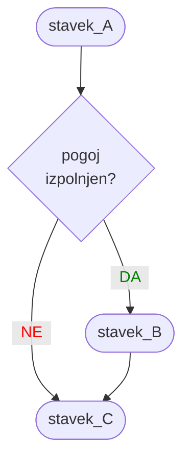
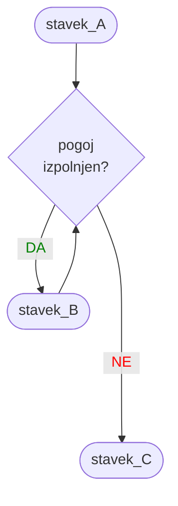
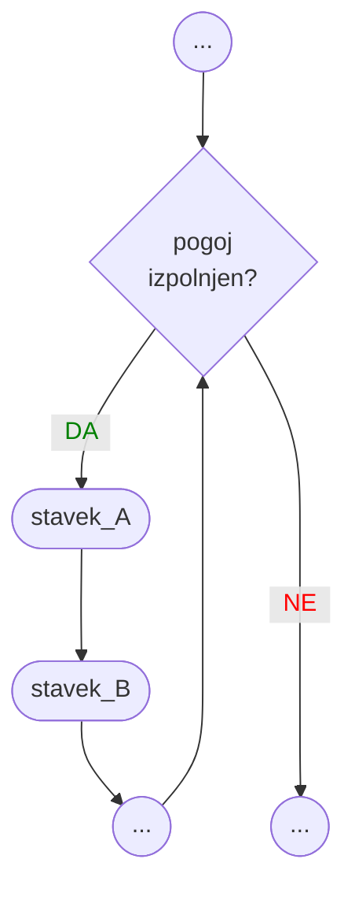
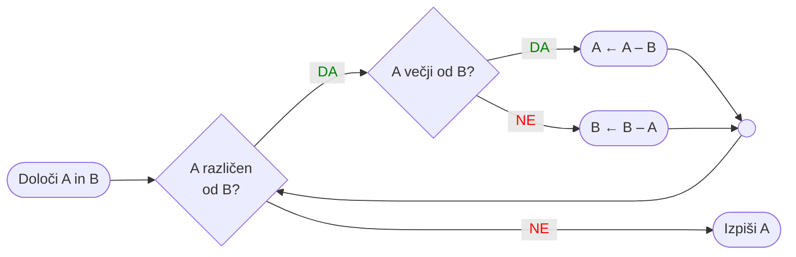

<!-- 
1. Spremeni `vite.config.ts`, da publicDir kaže na ustrezno mapo gradiva za predavanje 
    publicDir: './assets/04'
   Popravi ProgressBar completed na ustrezno številko predavanja
2. npx slidev OP-04-Zanka-while-moduli.md
3. npx slidev --remote=geslo OP-04-Zanka-while-moduli.md 
  če si presenter, potem uporabi url, ki ima notri ?password=geslo, da te ne gnjavi za vpis gesla
4. npx slidev build --out dist/04 OP-04-Zanka-while-moduli.md
5. npx slidev export OP-04-Zanka-while-moduli.md
6. gswin64 -sDEVICE=pdfwrite -dCompatibilityLevel=1.4 -dPDFSETTINGS=/printer -dNOPAUSE -dQUIET -dBATCH -sOutputFile=output.pdf OP-04-Zanka-while-moduli.pdf
7. move output.pdf OP-04-Zanka-while-moduli.pdf
-->

<ProgressBar bgcolor="#e54240" :completed=4 :total=13 />

# {{ $slidev.configs.title }}

Osnove programiranja

Nejc Ilc

<div class="abs-b m-6 flex gap-1 items-center justify-end text-red-500">
  <div><mdi-map-marker/> R2.41</div>
  <a class="text-2xl icon-btn !border-none !hover:text-gray"
  href="https://fri.uni-lj.si/sl/o-fakulteti/osebje/nejc-ilc">
    <mdi-web-box/>
  </a>
  <a class="text-2xl icon-btn !border-none !hover:text-gray"
  href="mailto:nejc.ilc@fri.uni-lj.si?subject=[OP-FKKT] ">
    <mdi-email/>
  </a>
  <a href="https://github.com/laspp/OP/tree/master/predavanja" target="_blank"
    alt="OP GitHub repository"
    class="text-2xl icon-btn !border-none !hover:text-gray">
    <carbon-logo-github />
  </a>
</div>

<!--
Zapiski predavatelja
-->

---

# Praskež bi se igral <Marker>[ugibaj_v1](https://scratch.mit.edu/projects/815262869)</Marker>
Če ne sprejmemo igre, bo spraskal sedežno

<a href="https://scratch.mit.edu/projects/815262869" target="_blank">

</a>

---

# Praskež bi se igral dlje časa <Marker>[ugibaj_v2](https://scratch.mit.edu/projects/815241970)</Marker>
Dovoli nam ugibati, dokler ne uganemo

<a href="https://scratch.mit.edu/projects/815241970" target="_blank">

</a>

---

# Zanko lahko naredimo tudi drugače <Marker>[ugibaj_v3](https://scratch.mit.edu/projects/815250407)</Marker>

<a href="https://scratch.mit.edu/projects/815250407" target="_blank">

</a>

---
layout: two-cols
class: text-center
---

# Pogojni stavek



::right::

# Zanka



---
layout: two-cols
---

# Zanka
To ni zanka za lov na zajce, bolj je podobna *loopingu*.

Zanka je sestavljena iz:

- <mark>glave</mark> (preverjanje pogoja) in
- <mark>telesa</mark> (stavki v bloku).

Zanka ponavlja stavke v svojem bloku, dokler je vstopni pogoj resničen.

Enemu obhodu zanke pravimo tudi <mark>iteracija</mark>.

Glava zanke vsebuje pogoj, ki ga lahko sestavimo na enak način kot pri pogojnemu stavku.

::right::

<div class="text-center">



</div>

---

# Evklidov algoritem
Se spomnimo tega?



---

# Evklidov algoritem v Pythonu <Marker>evklid_v1</Marker>
Spoznajmo zanko `while`

<div class="code-lg">

```python
A = int(input('Vnesi A: '))
B = int(input('Vnesi B: '))
while A != B:
    if A > B:
        A -= B
    else:
        B -= A
print('Največji skupni delitelj:', A)
```

</div>

Opazimo kaj novega?

- V redu, besedo `while`, ki opisuje zanko, bravo!
- Kaj je to `A -= B`? To je skrajšan zapis `A = A - B` in pomeni, da spremenljivki `A` odštejemo `B` in rezultat shranimo v `A`. Uporabimo lahko `+=`, `-=`, `*=`, `/=`, `**=`, `//=`, `%=`, ...

---

# `while True` <Marker>evklid_v2</Marker>
Brez zavore (break) ne bo šlo. Primerjaj to z [ugibaj_v3](https://scratch.mit.edu/projects/815250407) v Scratchu.

<div class="code-lg">

```python
A = int(input('Vnesi A: '))
B = int(input('Vnesi B: '))
while True:
    if A == B:
        break
    if A > B:
        A -= B
    else:
        B -= A
print('Največji skupni delitelj:', A)
```

</div>

---

# Če ima `if` svoj `else`, ga ima tudi `while`? <Marker>evklid_v3</Marker>
Python tudi tokrat ne razočara.

<div class="code-lg">

```python
A = int(input('Vnesi A: '))
B = int(input('Vnesi B: '))
while A != B:
    if A < 0 or B < 0:
        print('Ne znam z negativnimi števili.')
        break
    if A > B:
        A -= B
    else:
        B -= A
else:
    print('Največji skupni delitelj:', A)
```

</div>
<br/>

Blok `else` se izvede takrat, ko pogoj v glavi zanke `while` ni več resničen in se zanka ni končala z `break`.

---
layout: section
---

# Moduli
Python ima bogato knjižnico "razširitev" - modulov oz. paketov

---

# Python ima "baterije priložene"

## Vgrajene funkcije (built-in)

Te funkcije so vedno na voljo, ni jih potrebno izrecno uvažati. 

Primeri: `print()`, `input()`, `abs()`, `pow()`, `min()`, `max()`.

## Standardna knjižnica

Ko namestimo Python, se namesti tudi množica dodatnih modulov, ki pa jih moramo pred uporabo uvoziti v svoj program. Vsi moduli standardne knjižnice so navedeni tu: [https://docs.python.org/3/library/](https://docs.python.org/3/library/). Poglejmo si nekaj najbolj pogosto uporabljenih:

- `math`: matematika, npr. `pi`, `e`, `sqrt()`, `sin()`, `cos()`, `acos()`, `log()`, `log10()`
- `random`: psevdonaključna števila, npr. `random()`, `randint()`, `sample()`, `seed()`
- `time`: delo s časom, npr. , `sleep()`, `localtime()`, `perf_counter()`
- `sys`: sistemske zadeve, npr. `stdin`, `stdout`, `exit()`

---

# Imenski prostor
<br/>

Ko zaženemo program v Pythonu, se ustvari <mark>imenski prostor</mark>, v katerem živijo imena spremenljivk, funkcij in podobna golazen. Funkcija `dir()` nam to lepo izpiše. Zna pa izpisati tudi vse funkcije, ki jih neko ime ima.

<div class="code-lg">

```python
>>> dir()
['__annotations__', '__builtins__', '__doc__', '__loader__', '__name__', 
'__package__', '__spec__']
>>> novo_ime = 'OP'
>>> dir()
['__annotations__', '__builtins__', '__doc__', '__loader__', '__name__', 
'__package__', '__spec__', 'novo_ime']
>>> dir(novo_ime)
['__add__', '__class__', '__contains__', '__delattr__', '__dir__', '__doc__', 
'__eq__', '__format__', '__ge__', ..., 'capitalize', 'casefold', 'center', 'count',
'encode', 'endswith', 'expandtabs', 'find', 'format', 'format_map', 'index', 'isalnum',
'isalpha', 'isascii', 'isdecimal', 'isdigit', 'isidentifier', 'islower', 'isnumeric',...]
```

</div>

---

# Uvažanje modulov (1)
Pred uporabo moramo modul uvoziti

Modul uvozimo v imenski prostor programa. Poglejmo si nekaj načinov.

## `import ime_modula`

Modul uvozimo v globalni imenski prostor. Do funkcij in konstant modula pridemo tako: `ime_modula.ime_funkcije()`.

```python
>>> import math
>>> dir()
['__annotations__', '__builtins__', '__doc__', '__loader__', '__name__', 
'__package__', '__spec__', 'math']
>>> math.pi
3.141592653589793
>>> math.sin(math.pi/2)
1.0
```

---

# Uvažanje modulov (2)

## `import ime_modula as drugacno_ime`

Ime modula lahko ob uvozu spremenimo (skrajšamo, poslovenimo, karkoli). Do funkcij in konstant modula pridemo tako: `drugacno_ime.ime_funkcije()`.

```python
>>> import math as matematika
>>> dir()
['__annotations__', '__builtins__', '__doc__', '__loader__', '__name__', 
'__package__', '__spec__', 'matematika']
>>> matematika.pi
3.141592653589793
>>> matematika.sin(matematika.pi/2)
1.0
```

---

# Uvažanje modulov (3)

## `from ime_modula import funkcija_1, konstanta_1, funkcija_2`

Iz modula uvozimo samo nekatere sestavne dele (funkcije, konstante, ...), ki jih izrecno navedemo (vmes damo vejico). Do teh imen lahko pridemo brez navajanja imena modula. Paziti pa moramo, ker si s tem lahko povozimo že obstoječa imena.

```python
>>> from math import pi, sin
>>> dir()
['__annotations__', '__builtins__', '__doc__', '__loader__', '__name__', 
'__package__', '__spec__', 'pi', 'sin']
>>> pi
3.141592653589793
>>> sin(pi/2)
1.0
>>> del pi                # S stavkom `del` pobrišemo ime `pi`.
>>> pi = 3.14             # Nato ga definiramo po svoje.
>>> from math import pi   # Hm, kaj se bo zgodilo?
>>> pi                    # Jep, povozili smo ga.
3.141592653589793
```

---

# Uvažanje modulov (4)

## `from ime_modula import *`

Iz modula uvozimo vse njegove sestavne dele (funkcije, konstante, ...). Ponovno obstaja nevarnost, da si s tem lahko povozimo že obstoječa imena.

```python
>>> from math import *
>>> dir()
['__annotations__', '__builtins__', '__doc__', '__loader__', '__name__', 
'__package__', '__spec__', 'acos', 'acosh', 'asin', 'asinh', 'atan', 
'atan2', 'atanh', 'ceil', 'comb', 'copysign', 'cos', 'cosh', 'degrees', 
'dist', 'e', 'erf', 'erfc', 'exp', 'expm1', 'fabs', 'factorial', 'floor', 
'fmod', 'frexp', 'fsum', 'gamma', 'gcd', 'hypot', 'inf', 'isclose', 
'isfinite', 'isinf', 'isnan', 'isqrt', 'lcm', 'ldexp', 'lgamma', 'log', 
'log10', 'log1p', 'log2', 'modf', 'nan', 'nextafter', 'perm', 'pi', 'pow', 
'prod', 'radians', 'remainder', 'sin', 'sinh', 'sqrt', 'tan', 'tanh', 'tau', 
'trunc', 'ulp']
```

---

# Praskeževa igra v Pythonu <Marker>ugibaj_v4</Marker>
Kot osnovo vzamemo kodo v Scratchu [ugibaj_v2](https://scratch.mit.edu/projects/815241970) in dodamo: dovolimo do 5 poskusov, merimo čas igranja.


```python
from random import randint
from time import perf_counter

start = 20
stop  = 30
print('Izbral sem si število med ', start, ' in ', stop, '.', sep='')
izbrano_stevilo = randint(start, stop)
tic = perf_counter()
odgovor = int(input('Ajde, ugibaj, katero: '))
poskus = 1
while odgovor != izbrano_stevilo:
    print('Ah, kje pa, nimaš pojma.')
    if poskus >= 5:
        print('Zmanjkalo ti je poskusov :(')
        break
    odgovor = int(input('Poskusi ponovno: '))
    poskus += 1
else:
    print('Bravo!')
print('Izbral sem število', izbrano_stevilo)
toc = perf_counter()
print('Čas igranja:', round(toc-tic), 'sekund.')
```

---
layout: image-right
image: '/img/ivan-diaz-YOy-ek-aBR0-unsplash.jpg'
caption: 'Fotografija: Ivan Diaz'
url: 'https://unsplash.com/photos/YOy-ek-aBR0'
---

# 3, 2, 1, vzlet! <Marker>odstevanje</Marker>

<div class="code-xl">

```python
import time

sekund_do_vzleta = 3
while sekund_do_vzleta:
    print(
        sekund_do_vzleta,
        ', ',
        sep='',
        end=''
        )
    time.sleep(1)
    sekund_do_vzleta -= 1
print('vzlet!')
```

</div>

---

# Ustvarimo svoj lastni modul <Marker>ugibaj_v5</Marker> <Marker>ugibaj_modul</Marker>

<div class="grid grid-cols-2 gap-x-4">

<div>

### ugibaj_v5.py

```python
from random import randint
from time import perf_counter
import ugibaj_modul as ug

print(ug.bes_uvod)
izbrano_stevilo = randint(ug.start, ug.stop)
tic = perf_counter()
odgovor = int(input(ug.bes_poziv))
poskus = 1
while odgovor != izbrano_stevilo:
    print(ug.bes_napacno)
    if poskus >= ug.maks_poskusov:
        print(ug.bes_konec_poskusov)
        break
    odgovor = int(input(ug.bes_poziv_spet))
    poskus += 1
else:
    print(ug.bes_bravo)
print(ug.bes_resitev, izbrano_stevilo)
cas = str(round(perf_counter() - tic))
cas_izpis = ug.bes_cas.replace('???', cas)
print(cas_izpis)
```

</div>
<div>

### ugibaj_modul.py
Razne številčne konstante in nize za izpis shranimo v to datoteko, ki jo nato uvozimo kot modul. Nahajati se mora v isti mapi kot datoteka, ki uvozi ta modul.

```python
start = 20
stop  = 30
maks_poskusov = 5
bes_uvod = (
    'Izbral sem si število med ' +
    str(start) + ' in ' + str(stop) + '.'
    )
bes_poziv = 'Ajde, ugibaj, katero: '
bes_poziv_spet = 'Poskusi ponovno: '
bes_napacno = 'Ah, kje pa, nimaš pojma.'
bes_konec_poskusov = 'Zmanjkalo ti je poskusov :('
bes_bravo = 'Bravo! Bereš mi misli.'
bes_resitev = 'Izbral sem število'
bes_cas = 'Čas igranja: ??? sekund.'
```

</div>
</div>
---

# Pobegni: nadgradnje <Marker>pobegni_v1.1</Marker> <Marker>pobegni_v1.2</Marker>

## v1.0
Problemi, ki smo jih začutili prejšnji teden:

- ob napačni izbiri dejanja ali ob napačnem PINu za vrata se program konča,
- koda je precej nepregledna zaradi dolgih besedil.

<br/>

<div class="grid grid-cols-2 gap-x-4">

<div>

## v1.1

- Uporabimo zanke in igralca ponovno prosimo za vnos ob napaki.
- Besedila zberimo na enem mestu v kodi.

</div>
<div>

## v1.2

- besedila prestavimo v datoteko `pobegni_besedila.py` in jo uvozimo kot modul
- poenostavimo uganko za PIN, a dodamo naključje
- merimo čas za rešitev stopnje
- odklep ključavnice traja nekaj časa (dramatičnost)
- dodamo glavni meni (možnost izhoda iz igre)
 
</div>
</div>

---

<div class="absolute top-0 left-0">
<iframe width="980" height="551" src="https://www.youtube.com/embed/qozTkCHexH8" title="YouTube video player" frameborder="0" allow="accelerometer; autoplay; clipboard-write; encrypted-media; gyroscope; picture-in-picture; web-share" allowfullscreen></iframe>
</div>
