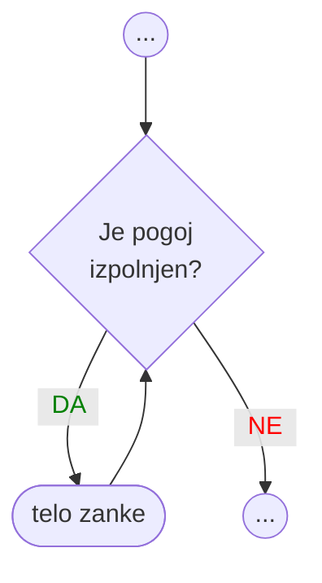
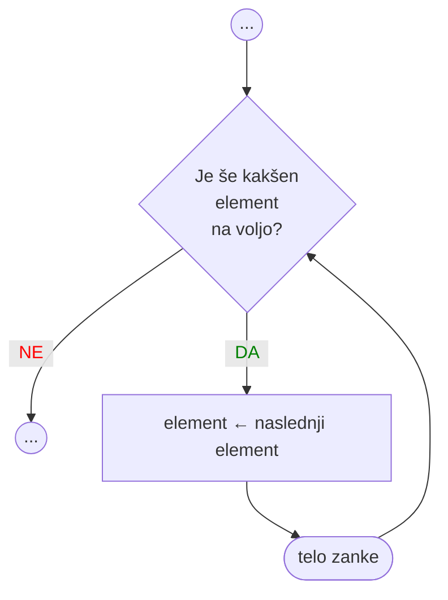

<!-- 
1. Spremeni `vite.config.ts`, da publicDir kaže na ustrezno mapo gradiva za predavanje 
    publicDir: './assets/06'
   Popravi ProgressBar completed na ustrezno številko predavanja
2. npx slidev OP-06-Zanka-for.md
3. npx slidev --remote=geslo OP-06-Zanka-for.md 
  če si presenter, potem uporabi url, ki ima notri ?password=geslo, da te ne gnjavi za vpis gesla
4. npx slidev build --out dist/04 OP-06-Zanka-for.md
5. npx slidev export OP-06-Zanka-for.md
6. gswin64 -sDEVICE=pdfwrite -dCompatibilityLevel=1.4 -dPDFSETTINGS=/printer -dNOPAUSE -dQUIET -dBATCH -sOutputFile=output.pdf OP-06-Zanka-for.pdf
7. move output.pdf OP-06-Zanka-for.pdf
-->

<ProgressBar bgcolor="#e54240" completed="6" total="13"/>

# {{ $slidev.configs.title }}

Osnove programiranja

Nejc Ilc

<div class="abs-b m-6 flex gap-1 items-center justify-end text-red-500">
  <div><mdi-map-marker/> R2.41</div>
  <a class="text-2xl icon-btn !border-none !hover:text-gray"
  href="https://fri.uni-lj.si/sl/o-fakulteti/osebje/nejc-ilc">
    <mdi-web-box/>
  </a>
  <a class="text-2xl icon-btn !border-none !hover:text-gray"
  href="mailto:nejc.ilc@fri.uni-lj.si?subject=[OP-FKKT] ">
    <mdi-email/>
  </a>
  <a href="https://github.com/laspp/OP/tree/master/predavanja" target="_blank"
    alt="OP GitHub repository"
    class="text-2xl icon-btn !border-none !hover:text-gray">
    <carbon-logo-github />
  </a>
</div>

<!--
Zapiski predavatelja
-->

---
layout: two-cols
class: text-center
---

# Zanka `while`
Ponavljaj, dokler je izpolnjen pogoj



::right::

# Zanka `for`
Ponavljaj, dokler imaš še kakšen element na voljo



---
layout: two-cols
---

# [Sintaksa](https://sl.wikipedia.org/wiki/Skladnja)
Kako pravilno pišemo zanko `for`

<div class="code-lg">

```python
for element in zaporedje:
    # Telo zanke
    # ...
else:
    # Ta blok je opcijski in se 
    # izvede, ko zmanjka elementov
    # in zanke nismo
    # prekinili z break
```

</div>

Zanka `for` torej pravi:

> "Za vsak element zaporedja izvedem stavke v mojem telesu.
>
> Ko zmanjka elementov, bom izvedla stavke v bloku `else`; seveda, če nisem prej končala zaradi `break`."

::right::

# Primer z nizi <Marker>jupidupi</Marker>
Spomnimo: nizi so zaporedje znakov

<div class="code-lg">

```python
zaporedje = 'ju.pi'
for element in zaporedje:
    if element == '.':
        break
    print(element)
else:
    print('dupi')
print('hej')
```

Kakšen bo izpis?

```python
j
u
hej
```

</div>

---
layout: two-cols-title
---

::title::

# Sprehod čez seznam
Da, seznami so tudi zaporedja

Imamo seznam imen

`seznam = ['Urban', 'Anže', 'Manca', 'Miha']`

::left::

Izpišimo seznam z zanko `for`.

<div class="code-xl">

```python
for element in seznam:
    print(element)
```

</div>
<br/>
<br/>

Zanka `for` je eleganten način za obdelavo elementov seznama, niza ali drugega zaporedja (terke, množice, slovarja).

::right::

Kako že to naredimo z zanko `while`?

<div class="code-xl">

```python
i = 0
while i < len(seznam):
    print(seznam[i])
    i += 1
```

</div>

Hm, z `while` ni tako lepo. Na kaj vse smo morali paziti?

---
layout: two-cols-title
---

::title::

# `for` + `range()`
Koristen par

Spomnimo se:

> Funkcija `range(zacetek, konec, korak)` vrne generator zaporedja celih števil na intervalu [`zacetek`, `konec`), pri čemer skačemo za `korak`.
> Primeri:
>
> - `list(range(1,6))` vrne seznam `[1, 2, 3, 4, 5]`; tu smo izpustili `korak` (privzeto je 1).
> - `list(range(1,6,2))` vrne seznam `[1, 3, 5]`
> - `list(range(6))` vrne seznam `[0, 1, 2, 3, 4, 5]`; tu smo izpustili `zacetek` (privzeto je 0) in `korak` (privzeto je 1).

::left::

Sprehodimo se čez seznam imen in pred imenom izpišimo še indeks elementa v seznamu.

<div class="code-lg">

```python
imena = ['Urh', 'Anže', 'Manca', 'Miha']
for i in range(len(imena)):
    print(i, imena[i])
```

</div>

::right::

Izdelajmo odštevalnik za rakete.

<div class="code-lg">

```python
zacetek = 5
for i in range(zacetek,0,-1):
    print(i)
print('vzlet!')
```

</div>

---
layout: two-cols
class: code-xl
---

# Sprehod po elementih
Zelo naravno in elegantno, če ne potrebujemo indeksov.

<br/>

```python
imena = ['Ana', 'Ida', 'Eva']

for ime in imena:
    print(ime)
```

::right::
# ... ali po indeksih
Izkoristimo `range()`, da dobimo seznam indeksov, ki jih nato lahko uporabimo za izpis, naslavljanje ali kaj drugega.

```python
imena = ['Ana', 'Ida', 'Eva']

for i in range(len(imena)):
    print(imena[i])
```

---
layout: two-cols
class: code-lg
---

# Primer: vsota prvih *n* pozitivnih števil <Marker>vsota</Marker>
Brez uporabe funkcije `sum()` 😛

```python
n = 20
vsota = 0
for i in range(1,n+1):
    vsota += i

print('Vsota prvih', n,
      'pozitivnih števil je',
      vsota)
```

::right::

# Primer: samo pozitivni v seznamu <Marker>pozitivni</Marker>
Izpišimo tista števila v seznamu, ki so večja od 0

```python
seznam = eval(
    input('Vnesi seznam števil: '))

print('Pozitivna števila so: ', end='')
for element in seznam:
    if element > 0:
        print(element, end=', ')
print() # Zaključna nova vrstica

# Druga možnost: izpis seznama s print()
pozitivni = []
for element in seznam:
    if element > 0:
        pozitivni.append(element)
print('Pozitivna števila so:', pozitivni)
```

---
layout: two-cols-title
class: code-lg
---

::title::
# Primer: najmanjši v seznamu <Marker>najmanjsi_v1</Marker>
Iskanje najmanjšega števila v seznamu naključnih števil

::left::

Najprej naredimo seznam naključnih števil. Pomagali si bomo s funkcijo `randint()` iz modula `random`.

```python
import random
import math

od = -100
do = 100
n  = 5

seznam = []
for i in range(n):
   seznam.append(random.randint(od,do))

print('Seznam:', seznam)
```

::right::

Sedaj poiščimo najmanjše število brez `min()` ali `sort()`.

```python
# Trenutni najmanjši element mora biti 
# nekaj zelo velikega! Neskončno?
najmanjsi = math.inf
# Namesto uvoza modula `math` 
# bi lahko uporabili tudi float('inf')

for el in seznam:
    if el < najmanjsi:
        najmanjsi = el
print('Najmanjši element je', najmanjsi)
```

---
layout: two-cols-title
class: code-lg
---

::title::
# Primer: indeks najmanjšega v seznamu <Marker>najmanjsi_v2</Marker>
Izpišimo še indeks najmanjšega elementa

::left::

Tokrat bomo seznam ustvarili s pomočjo funkcije `random.sample()`, ki
izbere *n* naključnih elementov v seznamu.

```python
from random import sample

od = -100
do = 100
n  = 5

seznam = sample(range(od, do+1), n)

print('Seznam:', seznam)
```

::right::

Poleg vrednosti najmanjšega elementa v seznamu si moramo tokrat zapomniti tudi njegov indeks. V zanki bomo torej šli čez seznam indeksov.

```python
najmanjsi = float('inf')
najmanjsi_indeks = 0

for i in range(len(seznam)):
    el = seznam[i]
    if el < najmanjsi:
        najmanjsi = el
        najmanjsi_indeks = i
print('Najmanjši element je', najmanjsi,
      'na indeksu', najmanjsi_indeks)
```

---
class: code-lg
---

# Primer: najmanjši pozitiven v seznamu <Marker>najmanjsi_v3</Marker>
Najmanjši element iščemo samo med večjimi od 0

```python {13}
from random import sample

od = -100
do = 100
n  = 5
seznam = sample(range(od, do+1), n)
print('Seznam:', seznam)

najmanjsi = float('inf')
najmanjsi_indeks = 0
for i in range(len(seznam)):
    el = seznam[i]
    if el > 0 and el < najmanjsi:
        najmanjsi = el
        najmanjsi_indeks = i
print('Najmanjši element je', najmanjsi, 'na indeksu', najmanjsi_indeks)
```

---
layout: two-cols-title
class: code-lg
---

::title::

# Niz - nekaj sprehodov čezenj
Večkrat smo že rekli, da so nizi zaporedja in se lahko sprehajamo čez njihove elemente

::left::
## Vsi šumniki <Marker>sumniki</Marker>

```python
niz = 'Železni škafec pušča.'

for znak in niz:
    # Znak pretvorimo v malo črko
    znak_mali = znak.lower()
    
    # Kar je v oklepajih,
    # gre lahko preko več vrstic
    if (znak_mali == 'č' or
        znak_mali == 'š' or
        znak_mali == 'ž'):
        print(znak)   
```

::right::

## Najmanjši znak <Marker>najmanjsi_znak</Marker>

```python
niz = '0123!čšž.ﻺ'
najmanjsi = niz[0] # Dober trik!
najmanjsi_indeks = 0

for i in range(len(niz)):
    if niz[i] < najmanjsi:
        najmanjsi = niz[i]
        najmanjsi_indeks = i

print('Najmanjši znak je "', najmanjsi,
      '" na indeksu ', najmanjsi_indeks, 
      '.', sep='')
```

*Mimogrede: kaj naredi funkcija `ord('A')`?*

---
class: code-lg
---

# Iskanje elementa v seznamu
To naredimo zelo preprosto z operatorjem `in`, ampak zaradi vaje ne bomo

Program naj dela podobno kot metoda `index(el)`, ki vrne indeks prve pojavitve elementa `el` v seznamu/nizu. Ko najdemo iskani element, naj se zanka ustavi (varčujmo z energijo). Če iskanega elementa nismo našli, naj program to izpiše.

```python
seznam = ['Ana', 'Ida', 'Ana', 'Eva']
iskan_el = 'Ana'

for i in range(len(seznam)):
    if iskan_el == seznam[i]:
        print(i)
        break
else:
    print('Elementa', iskan_el, 'ni v seznamu.')
```

---
layout: image-left
image: '/img/lpp_postaja.jpg'
url: 'https://ljbus.cc/'
caption: 'Fotografija: ljbus.cc'
---

# Fibonaccijevo zaporedje <Marker>fibonacci</Marker>
Ko boste naslednjič čakali mestni avtobus ...

Zaporedje, v katerem je vsak člen vsota prejšnjih dveh:

$F_0 = 0,\quad F_1 = 1,\quad F_n = F_{n-1} + F_{n-2}$

```python
# Koliko členov izpišemo
n = 100

# Začetne vrednosti za prva dva člena
F_2prej = 1  # dve števili nazaj od trenutnega
F_1prej = 2  # eno število nazaj od trenutnega

for i in range(n):
    print(F_2prej)
    Fn = F_2prej + F_1prej
    F_2prej = F_1prej
    F_1prej = Fn
```

---
layout: two-cols-title
class: code-lg
---

::title::

# Spreminjanje elementov seznama <Marker>spremeni</Marker>

::left::

Vsem nizom v seznamu dajmo veliko začetnico

```python
imena = ['Ana', 'ida', 'eva', 'ada']

for ime in imena:
    ime.capitalize()
print(imena)
```

Izpis: `['Ana', 'ida', 'eva', 'ada']`. Ni šlo 😢

```python
# Spremembo moramo shraniti v seznam
for i in range(len(imena)):
    imena[i] = imena[i].capitalize()
print(imena)
```

Izpis: `['Ana', 'Ida', 'Eva', 'Ada']`. Bolje!

::right::

Kvadrirajmo vsa števila v seznamu

```python
stevila = list(range(10))
print(stevila)
for i in range(len(stevila)):
    stevila[i] **= 2
print(stevila)
```

Izpis:

```
[0, 1, 2, 3, 4, 5, 6, 7, 8, 9]
[0, 1, 4, 9, 16, 25, 36, 49, 64, 81]
```

---
layout: two-cols-title
class: code-lg
---

::title::

# Praštevila <Marker>prastevila</Marker>
Praštevilo je naravno število, ki ima točno dva pozitivna delitelja: število 1 in samega sebe.

::left::

Preverimo, ali je podano število `n` praštevilo.

```python
n = int(input('Vnesi število: '))

if n < 1:
    print('Število mora biti pozitivno.')
else:
    for i in range(2,n):
        if n % i == 0:
            print(n, 'ni praštevilo.')
            break
    else:
        print(n, 'je praštevilo.')
```

::right::

Izpišimo vsa praštevila manjša od `n`. Uporabimo zanko na levi za preverjanje, ali je neko število praštevilo. Ta test uporabimo na vseh številih od 1 do `n`.

```python
for m in range(1,n+1):
    for i in range(2,m):
        if m % i == 0:
            break
    else:
        print(m)
```

---
layout: two-cols
---

<Image src="/img/Chessboard_labels_knight.svg" caption="Slika: ILA-boy" url="https://commons.wikimedia.org/wiki/File:AAA_SVG_Chessboard_and_chess_pieces_02.svg"/>

:: right::

# Skoki konja <Marker>sahovnica_konj</Marker>
Tole bo super vaja za ponovitev vsega

1. Program uporabnika vpraša po velikosti igralne plošče (n × n polj), nato
2. izdela seznam polj (seznam vrstic, vsaka vrstica je seznam polj)
3. in ta seznam izpiše na zaslon
4. skupaj z oznakami vrstic (1...n) in stolpcev (a...)
5. ter tudi položaj belega konja (začne na b1).
6. Nato naj program uporabnika vpraša po novem položaju konja
7. in zatem preveri veljavnost poteze ter bodisi
8. gre na korak 6, če poteza ni veljavna, bodisi
9. gre na korak 2, če je poteza veljavna.

---
layout: two-cols
---

# Pobegni! <Marker>pobegni_v2.0</Marker>
Nova stopnja!

Uporabimo program `sahovnica_konj.py` s prejšnje strani, da izdelamo drugo stopnjo naše igre pobega.

Spremembe od verzije 1.2:

- uporabimo funkcijo `eval()` za računsko uganko, katere rešitev je PIN za modra vrata;
- razpoložljiva dejanja so urejena v seznam
  
  ```python
  s1_dejanja = [
  'Odpri modra vrata.',
  'Poglej, kaj je na mizi.']
  ```

- Ko odklenemo modra vrata, se znajdemo v novi sobi. Kaj sobi, dvorani!

::right::

<div class="code-no-ligatures">

```
Skozi modra vrata vstopiš v prostorno halo.
Spominja te na grajsko plesno dvorano, v daljavi
celo slišiš pritajeno igranje orkestra.
Tla dvorane so videti kot ogromna šahovnica
z belimi in črnimi polji. Videti je, da so polja
označena s številkami in črkami. Po vseh štirih
stenah dvorane so obešene slavne slike konj,
med drugimi tudi ta: https://rb.gy/groo5t.

Poleg modrih vrat, pred katerim stojiš, ima dvorana
še troje vrat - označena so z 'v'. Tvoj trenutni
položaj je d1 in je prikazan z '×'.

8│░░██░░██░░██v ██
7│v ░░██░░██░░██░░
6│░░██░░██░░██░░██
5│██░░██░░██░░██v 
4│░░██░░██░░██░░██
3│██░░██░░██░░██░░
2│░░██░░██░░██░░██
1│██░░██ ×██░░██░░
 └────────────────
  a b c d e f g h
Vneseš oznako polja, kamor želiš iti.
----------------------
X: izhod
```

</div>