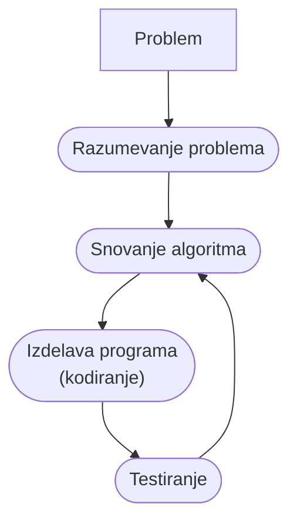

<ProgressBar bgcolor="#e11d48" completed="1" total="13"/>

# Naslov

Osnove programiranja

Nejc Ilc

<div class="abs-b m-6 flex gap-1 items-center justify-end text-red-600 opacity-100">
  <div><mdi-map-marker/> R2.41</div>
  <a class="text-2xl icon-btn !border-none !hover:text-gray"
  href="https://fri.uni-lj.si/sl/o-fakulteti/osebje/nejc-ilc">
    <mdi-web-box/>
  </a>
  <a class="text-2xl icon-btn !border-none !hover:text-gray"
  href="mailto:nejc.ilc@fri.uni-lj.si?subject=[OP-FKKT] ">
    <mdi-email/>
  </a>
  <a href="https://github.com/laspp/OP/tree/master/predavanja" target="_blank"
    alt="OP GitHub repository"
    class="text-2xl icon-btn !border-none !hover:text-gray">
    <carbon-logo-github />
  </a>
</div>

<!--
Zapiski predavatelja
-->

---

# Naslov strani

- besedilo 1
- besedilo 2
- [https://ucilnica.fri.uni-lj.si](https://ucilnica.fri.uni-lj.si/course/view.php?id=244)
- dogovori in pravila
- forum za **novice** in forum za **vaše objave**
- ...

---
layout: image
image: '/01/img/stable-diffusion-superman-batman-2.jpg'
caption: 'Primer slike z HTML opisom <a href="https://stablediffusionweb.com"
  target="_blank">stablediffusionweb.com</a> <i>illustration</i>.''
transition: slide-left
---

---
layout: fact
---

# Zakaj

se učiti programiranja?

---
layout: image-right
image: '/01/img/curtain-theatre.jpg'
caption: 'Fotografija: Gwen King'
url: 'https://unsplash.com/photos/m3th3rIQ9-w'
---

# Slika na desni

> Česar ne poznaš, se navadno bojiš ali preziraš.\
> Kar poznaš, lahko tudi kritiziraš, spreminjaš in nadzoruješ.\
> Razviti moramo kritično mišljenje v odnosu do tehnologije.

---
layout: image-left
image: /01/img/cooking.jpg
caption: 'Fotografija: Mae Mu'
url: 'https://unsplash.com/photos/rgRbqFweGF0'
---

# Slika na levi

Besedilo

---

# Dva stolpca in diagram

<div class="grid grid-cols-2 gap-x-4">

<div>



</div>
<div>

Lahko uporabiš tudi layout: two-cols

Komponenta `<Image/>`

<Image width="380" alt="LEGO Mindstorms EV3" src="/01/img/EV3.jpg"
caption="Slika: LEGO Mindstorms EV3" url="https://makecode.mindstorms.com/getting-started/use"/>

</div>
</div>

---

# Koda

<div class="grid grid-cols-2 gap-x-4">

<div>

## Psevdo koda

Neformalni zapis algoritma po korakih

```
določi A
določi B
dokler je A različen od B ponavljaj:
    če je A večji od B:
        A naj dobi vrednost A – B
    sicer (če je B večji od A):
        B naj dobi vrednost B – A
izpiši A
```

</div>

<div>

## Programski jezik Python

Psevdo kodo prepišimo v angleščino

```python
A = 100
B = 75
while A != B:
    if A > B:
        A = A - B
    else:
        B = B - A
print(A)
```

</div>
</div>
